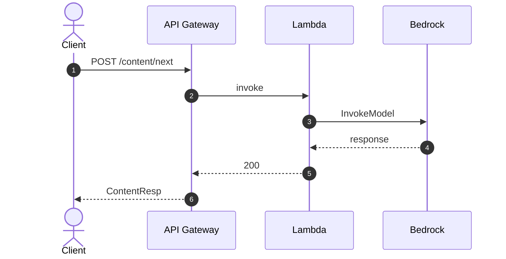

# Diagram Conventions (Project Standard)

**Applies to**: すべての `aidlc-docs/**/*.md` ドキュメント (INCEPTION / CONSTRUCTION / OPERATIONS 全フェーズ)
**Priority**: このプロジェクト固有ルールは、`common/ascii-diagram-standards.md` に優先する (プロジェクト指定は workspace-level > global)。

## MANDATORY: Sequence Diagrams は Mermaid で記述すること

シーケンス図 (時系列で actor / participant 間のメッセージをやり取りするダイアグラム) は、**必ず Mermaid `sequenceDiagram` 記法** を使用する。ASCII 罫線 (`│ ├ └ ─► ◄──` 等) や、プレーンな box-drawing で表現してはならない。

## MANDATORY: participant は AWS サービスレベルで揃えること

シーケンス図の `actor` / `participant` は **AWS サービスレベル** (Client / API Gateway / Lambda / DynamoDB / S3 / Bedrock / Cognito / EventBridge / CloudFront / Step Functions 等) に統一する。

- アプリ内のコンポーネント ID (例: `FE-07`, `BE-01`, `ProfileRepo`, `S-02`) や関数名を participant にしない
- Lambda 内の責務 / サービス関数 / リポジトリ呼び出しは、`Note over Lambda: ...` で補足する
- 同一 Lambda 内の self-call (`Lambda->>Lambda`) は避ける → 代わりに Note で列挙する
- Client 側の細分 (SchedulerClient / ApiClient / UI 等) も "Client" に集約する。必要に応じ Note で補足
- 例外: `Lambda (s2_reminder)` のように、同種サービスが複数登場するときは括弧で識別子を付けてよい

**理由**: ドキュメントの寿命を長く保つ (リファクタで変わる実装詳細ではなく、寿命の長い AWS リソース境界で記述)、AWS アーキテクチャ図との対応が明確になる。

### 理由

- 描画ツール / エディタ間のレンダリング差異を排除 (GitHub / Kiro / VS Code / 印刷 PDF で統一)
- Mermaid は `actor` / `participant` / `autonumber` / `alt` / `opt` / `par` / `Note over` が使え、シーケンス表現力が ASCII より高い
- ダイアグラムが diff しやすく、レビューコストが下がる

### 正しい例



### NG 例 (禁止)

```
Client            API Gateway          Lambda          Bedrock
   │                    │                 │               │
   ├──► POST            │                 │               │
   │   /content/next    │                 │               │
   │                    ├──► invoke       │               │
   │                    │                 ├──► Invoke ───►│
```

### 適用範囲の判定ガイド

以下のいずれかに該当する図は「シーケンス図」として扱い、Mermaid で書く:

- **Lifeline (縦線) をもつ図**: 参加者/アクターごとに縦線を引き、時系列に左右のメッセージを交換している
- **actor / participant の明示**: 複数サブシステム間の呼び出し順序を示すことが主目的
- **リクエスト/レスポンスの往復**: HTTP / API 呼び出し、イベント発火、外部サービス連携 (Bedrock / Cognito / S3 / EventBridge 等) を時系列で並べている

反対に、以下は Mermaid `sequenceDiagram` 以外 (`flowchart`, `graph`, ASCII box, 表など) を使ってよい:

- 静的な **依存関係 / コンポーネント構造** (時系列要素なし) → `flowchart` または ASCII ボックス
- **データフロー / パイプライン** で lifeline を持たない単方向遷移 → `flowchart`
- **階層構造 / ツリー** → `flowchart` / indented list
- **マトリクス / 状態遷移表** → Markdown table

## その他のダイアグラム

- **コンポーネント関係図 / 静的依存グラフ**: Mermaid `flowchart` を優先。簡素な図は ASCII ボックスでも可 (`common/ascii-diagram-standards.md` に従う)。
- **状態遷移図**: Mermaid `stateDiagram-v2` を優先。
- **アーキテクチャ概要図**: Mermaid `flowchart` を優先 (サブグラフでゾーン分け可)。

## Validation Checklist (新規 / 更新時)

`aidlc-docs/` 配下のドキュメントに図を追加 / 更新する際、以下を確認する:

- [ ] シーケンス性のある図は Mermaid `sequenceDiagram` を使用しているか
- [ ] `participant` / `actor` は **AWS サービスレベル** (Client / API Gateway / Lambda / DynamoDB / S3 / Bedrock / Cognito / EventBridge 等) に統一したか
- [ ] アプリ内コンポーネント ID (FE-xx / BE-xx / S-xx / Repo) を participant として使っていないか (使う場合は `Note over Lambda: ...` に移動したか)
- [ ] Mermaid コードブロックは ` ```mermaid` で囲まれているか
- [ ] `participant` / `actor` の alias は日本語文字列の場合 `as` で別名付与しているか
- [ ] `autonumber` を用いてステップ番号を付与したか (推奨)
- [ ] 条件分岐/並列/ノートは `alt` / `opt` / `par` / `Note over` を用いて表現したか
- [ ] 既存ドキュメントに ASCII 製シーケンス図が残っていれば、本ルール適用時に Mermaid へ置換したか

## 既存 ASCII シーケンス図の扱い

本ルール導入以前に作成された ASCII シーケンス図は、**次に当該ファイルを変更する機会に Mermaid へ置換** する。新規追加はすべて Mermaid で行うこと。
