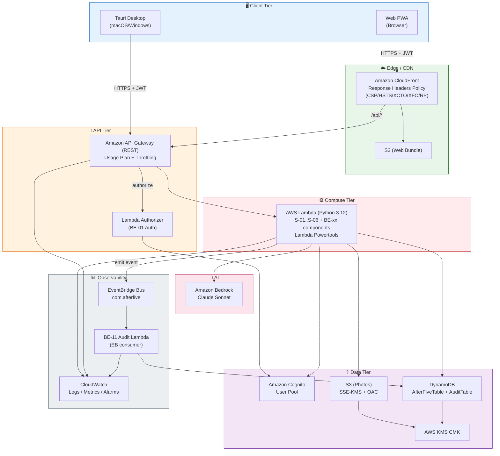

# Application Design — アフターファイブ

**Version**: 1.0
**Last Updated**: 2026-05-07
**Purpose**: Requirements と User Stories を受けて、高レベルアーキテクチャ・コンポーネント・サービスレイヤを設計する統合ドキュメント。詳細ビジネスロジックは後段の Functional Design で。

---

## Table of Contents

1. Architecture Overview
2. Decision Summary (Plan 回答の反映)
3. Component Catalog (→ `components.md` 参照)
4. Component Methods (→ `component-methods.md` 参照)
5. Services (→ `services.md` 参照)
6. Dependencies (→ `component-dependency.md` 参照)
7. Data Model Overview (DynamoDB Single-Table)
8. Architecture Diagram (Context + Container)
9. NFR Coverage at Design Level
10. Open Questions for Next Stages

---

## 1. Architecture Overview

「アフターファイブ」は以下の 3 層で構成されるサーバーレス Web+Desktop アプリです:

```
+-----------------------------------+
|   Client Tier                     |
|  - Tauri Desktop (macOS/Windows)  |
|  - Web PWA (CloudFront + S3)      |
|   (同一 React+TS コード)          |
+-----------------------------------+
                |
          HTTPS + Cognito JWT
                |
+-----------------------------------+
|   API & Compute Tier              |
|  - Amazon API Gateway (REST)      |
|  - AWS Lambda (Python 3.12)       |
|  - Lambda Authorizer (JWT verify) |
+-----------------------------------+
                |
+-----------------------------------+
|   Data & AI Tier                  |
|  - DynamoDB (Single-Table)        |
|  - S3 (Photos, SSE-KMS, OAC)      |
|  - Amazon Cognito User Pool       |
|  - Amazon Bedrock (Claude)        |
|  - EventBridge (監査/通知イベント) |
|  - CloudWatch (Logs/Metrics/Alarm)|
+-----------------------------------+
```

**Core design principle**: クライアント中心のスケジューリング (FE-07 SchedulerClient) + サーバーは stateless な REST API + 外部化された AI / データ。

---

## 2. Decision Summary

Plan 回答の反映 (詳細は `plans/application-design-plan.md`):

| 論点 | 決定 | 根拠 |
|---|---|---|
| バックエンド粒度 | **細粒度 25 コンポーネント** (A1=A) | 責務分離、PBT/Security ルール適用先が明確、Units 分解しやすい |
| フロントアーキ | **Clean Architecture (Ports & Adapters)** (A2=C) | Tauri / Web 差分吸収が構造的に自然 |
| プラットフォーム差分 | **Adapter パターン** (A3=A) | テスト容易、将来追加プラットフォームに対応可 |
| メソッドシグネチャ | **OpenAPI / JSON Schema 風** (B1=B) | フロント/バック両者で共通、言語非依存 |
| エラー戦略 | **例外ベース** (B2=B) | Python 慣用、Lambda Powertools と相性良、トップレベルで一括変換 |
| サービスレイヤ | **単一 Lambda 内の service 関数** (C1=C) | MVP に最適、低コスト、分離は論理層で |
| 非同期処理 | **MVP 同期 → 将来非同期** (C2=C) | 単純、API Gateway の 29s 内で十分 |
| スケジューラ | **クライアントサイド** (C3=A) | API コストゼロ、Tauri/Web どちらもフォアグラウンドで動作保証 |
| 通信パターン | **同期直接 + EventBridge ハイブリッド** (D1=D) | 主要フロー高速 + 監査は疎結合 |
| データアクセス | **Single-Table + Repository** (D2=C) | DynamoDB ベストプラクティス、テスタブル |
| API 契約 | **OpenAPI (YAML)** (D3=A) | 型生成で安全、ドキュメント自動化 |
| 全体アーキスタイル | **実用的レイヤード** (E1=C) | ハッカソン向け、DDD は過剰 |
| IDOR 対策 | **多層防御 (A+B+C 全部)** (E2=D) | Defense in Depth、Security Baseline 準拠 |
| ログ/監査 | **Lambda Powertools + Audit DDB** (E3=A) | Python Lambda の標準、SEC-03/13/14 に直結 |

---

## 3. Component Catalog

詳細は `aidlc-docs/inception/application-design/components.md`

### Summary
- **Frontend**: 9 components (AppShell, Onboarding, ReminderFeed, NotificationAdapter, TerminationOverlay, PhotoManager, SchedulerClient, ApiClient, PlatformAdapter)
- **Backend**: 12 components (Auth, Profile, SchedulerRef, ContentSelection, ContentRepo, Photo, History, Reaction, Termination, Notification, Audit, Infrastructure)
- **Cross-Cutting**: 4 modules (Observability, SharedModels, RepositoryLayer, ErrorHandling)

**Total**: 25 コンポーネント。全 27 User Story にマッピング完了 (components.md の Traceability Matrix)。

---

## 4. Component Methods

詳細は `aidlc-docs/inception/application-design/component-methods.md`

### Summary

- 公開 API: REST / OpenAPI 準拠 (`/profile`, `/content/next`, `/photos/*`, `/terminations/*`, `/reactions`, `/history`, `/notifications/subscriptions`, `/account`)
- 内部関数: Python 型付き疑似コード + 入出力スキーマ
- 純粋関数 (`compute_rate_table`, `next_present_at`) は PBT-05 oracle
- 全ての write メソッドは idempotent (PBT-04)

---

## 5. Services

詳細は `aidlc-docs/inception/application-design/services.md`

### Summary (6 Orchestration Services)

| Service | Purpose |
|---|---|
| **S-01 Onboarding** | サインアップ + ヒアリング完了 |
| **S-02 Reminder** | コア体験: Bedrock 連携で「別の未来」を選定・記録 |
| **S-03 Termination** | 定時到達 / 早期退勤の記録 + ねぎらい生成 |
| **S-04 Reaction** | リアクション記録 + LEAVE_NOW の二次発火 |
| **S-05 PhotoUpload** | Pre-signed URL 発行 + 確認 + 削除 |
| **S-06 AccountDeletion** | 全データ包括削除 (Full) |

**境界ルール**:
1. Controller は 1 Service のみ呼ぶ
2. Service 間は呼び合わない (必要なら EventBridge)
3. Service → Component → Repository の階層厳守

---

## 6. Dependencies

詳細は `aidlc-docs/inception/application-design/component-dependency.md`

### Summary

- **同期**: Client → API Gateway → Service → Component → Repository → AWS サービス
- **非同期**: EventBridge バス `com.afterfive` でイベント発火、BE-11 Audit 等がコンシューム
- **循環依存**: ゼロ ✅
- **Service 間独立**: ✅ (S-04 → S-03 のみ EventBridge 経由)

---

## 7. Data Model Overview (DynamoDB Single-Table)

**Table: `AfterFiveTable`**

| Entity | PK | SK | 主要属性 |
|---|---|---|---|
| UserProfile | `USER#<userId>` | `PROFILE` | punctualityTime, area, hobbyCategories, familyMembers[], petInfo[], foodPreferences[], oshi[], gameGenres[], uiToneIntensity |
| Photo | `USER#<userId>` | `PHOTO#<photoId>` | s3Key, status, tag (family/pet/other), uploadedAt, aiCaption |
| History | `USER#<userId>` | `HISTORY#<yyyy-mm-dd>#<iso-ts>#<contentId>` | category, generatedBody, presentedAt, contextSnapshot |
| Reaction | `USER#<userId>` | `REACTION#<iso-ts>#<contentId>` | action (SEEN/IGNORE/LEAVE_NOW), clientIdempotencyKey |
| Termination | `USER#<userId>` | `TERMINATION#<yyyy-mm-dd>` | trigger, clockOutAt, message |
| Content (dummy) | `CONTENT#<category>` | `<contentId>` | title, body, imageKey, metadata |

**Table: `AuditTable`** (分離、append-only)

| Entity | PK | SK | 主要属性 |
|---|---|---|---|
| AuditEvent | `AUDIT#<yyyy-mm-dd>` | `<iso-ts>#<actor>#<uuid>` | action, resourceType, resourceId, before, after, sourceIp |

**GSI (初期案)**:
- `GSI1`: `GSI1PK=CATEGORY#<category>`, `GSI1SK=<iso-ts>` — カテゴリ横断の履歴集計 (Full で使用)
- `GSI2`: `GSI2PK=<photoTag>`, `GSI2SK=<userId>#<uploadedAt>` — タグ別写真検索 (MVP では不要かも、後段で判断)

**Access Patterns**:
1. GetProfile(userId) → PK=USER#userId, SK=PROFILE
2. ListUserPhotos(userId) → PK=USER#userId, SK begins_with PHOTO#
3. GetRecentHistory(userId, N) → PK=USER#userId, SK begins_with HISTORY#<today>, ScanIndexForward=false, Limit=N
4. PutTerminationIfAbsent(userId, date) → PK=USER#userId, SK=TERMINATION#date, ConditionExpression=attribute_not_exists(SK)
5. GetContentByCategory(category) → PK=CONTENT#category, ScanIndexForward with random pagination (or ContentRepository が全件キャッシュ)

---

## 8. Architecture Diagram (Container Level)



### Text Alternative (Architecture Summary)

```
Client: Tauri Desktop + Web PWA (同一 React/TS)
  │
  └→ (Web) CloudFront → S3 Static Bundle + (API path) → API Gateway
  └→ (Tauri) HTTPS → API Gateway 直接
       │
       ├─ Lambda Authorizer → Cognito User Pool
       └─ Lambda (Service + Component)
            ├─ DynamoDB (AfterFiveTable / AuditTable) ← KMS 暗号化
            ├─ S3 (Photos) ← KMS + Public Access Block
            ├─ Bedrock (Claude) ← 5s timeout, fallback あり
            ├─ EventBridge (副作用: Audit / Notification)
            └─ CloudWatch (Logs + Metrics + Alarms)
```

---

## 9. NFR Coverage at Design Level

### 9.1 Security Baseline (全 15 ルール)

| Rule | Covered By (Design) | Status |
|---|---|---|
| SEC-01 暗号化 | DynamoDB SSE-KMS + S3 SSE-KMS + TLS 1.2+ (CloudFront/API GW) | ✅ Compliant |
| SEC-02 NW ログ | CloudFront + API Gateway access logs → CloudWatch | ✅ Compliant |
| SEC-03 アプリログ | X-01 Lambda Powertools 全 Lambda に注入、PII filter | ✅ Compliant |
| SEC-04 HTTP Headers | CloudFront Response Headers Policy | ✅ Compliant |
| SEC-05 入力検証 | X-02 Pydantic + OpenAPI validation + 全 POST/PATCH handler | ✅ Compliant |
| SEC-06 最小権限 | Lambda ロール per-service (細分化), 次 Infrastructure Design で具体化 | 🟡 Planned |
| SEC-07 NW 制限 | CloudFront + API Gateway のみ公開、S3/DDB は private | ✅ Compliant |
| SEC-08 認可 (IDOR) | 多層防御: Lambda Authorizer + @requires_ownership + Repository user_id WHERE (E2=D) | ✅ Compliant |
| SEC-09 ハードニング | 汎用エラーメッセージ (X-04), S3 Public Block, 既定資格不使用 | ✅ Compliant |
| SEC-10 Supply Chain | pip/npm lockfile, CI で audit (後段) | 🟡 Planned |
| SEC-11 安全な設計 | 認可集中 (BE-01), Rate Limit (API GW Usage Plan), misuse 1 件以上 (IDOR) | ✅ Compliant |
| SEC-12 認証 | Cognito パスワードポリシー + 無認証 API なし | ✅ Compliant |
| SEC-13 完全性 | BE-11 Audit append-only, SE 素材 SRI, Pydantic 安全 deserialize | ✅ Compliant |
| SEC-14 監視 | CloudWatch Alarms (auth fail, 5xx), Log Retention ≥90日 | ✅ Compliant |
| SEC-15 例外処理 | X-04 例外階層 + top-level catch + fail-safe default (Bedrock フォールバック) | ✅ Compliant |

**Blocking findings**: **なし**。Planned (SEC-06/10) は後段ステージで詳細化。

### 9.2 PBT (全 10 ルール)

| Rule | Covered By (Design) | Status |
|---|---|---|
| PBT-01 Property Identification | Per-unit Functional Design で精査 (全 Unit) | 🟡 Planned |
| PBT-02 Round-Trip | X-02 SharedModels の JSON round-trip, Repository put/get | ✅ Compliant |
| PBT-03 Invariant | BE-03 `compute_rate_table`, BE-04 文字数制約, FE-07 Scheduler invariant | ✅ Compliant |
| PBT-04 Idempotence | BE-02 upsert, BE-06 confirm, BE-08 reaction, BE-09 termination, FE-07 startSession | ✅ Compliant |
| PBT-05 Oracle | BE-03 reference table を FE-07 SchedulerClient のテストで比較 | ✅ Compliant |
| PBT-06 Stateful | FE-07 SchedulerClient + BE-07+BE-08 の一連コマンドを模擬モデルと比較 | ✅ Compliant |
| PBT-07 Generator Quality | X-02 に custom strategies (profile, location, hearing) | ✅ Compliant |
| PBT-08 Shrinking | Hypothesis / fast-check default 有効、CI seed log | 🟡 Planned (CI 設計で確定) |
| PBT-09 Framework | Python=Hypothesis / TS=fast-check (Requirements で確定済) | ✅ Compliant |
| PBT-10 Complementary | 各 Story AC を example-based E2E としても実装 (後段 Build and Test で確定) | 🟡 Planned |

**Blocking findings**: **なし**。

---

## 10. Open Questions for Next Stages (Units Generation 以降)

以下は Application Design では決めず、次のステージで決める事項:

- **Units (Unit of Work)** 分解の正式化 (`component-dependency.md` の予告を採用するか、別案か)
- **Lambda 関数の物理分割**: ルートごと 1 関数 / サービス単位 1 関数 / モノリス 1 関数 のいずれにするか → Infrastructure Design
- **Bedrock モデル選定**: Claude Sonnet vs Haiku、コストと品質のトレードオフ → NFR Design
- **CI/CD パイプライン**: GitHub Actions / AWS CodePipeline / 他 → Infrastructure Design + Build and Test
- **Tauri の自動アップデート**: 必要か、どの仕組みを使うか → 次段で判断
- **DynamoDB Single-Table の GSI 追加**: 実際のアクセスパターンを見ながら
- **フロントエンドの State Management**: Zustand / Jotai / Redux Toolkit / TanStack Query → Functional Design

---

## 11. Deliverable Checklist (Self-Review)

- [x] `components.md` 全 25 コンポーネントを定義、責務と Story マップ
- [x] `component-methods.md` 全コンポーネントの公開メソッドを OpenAPI 風に記述
- [x] `services.md` 6 オーケストレーションサービスを定義
- [x] `component-dependency.md` 依存マトリクス + Mermaid 図 + 非循環検証
- [x] `application-design.md` (本ドキュメント) で全体統合 + アーキ図
- [x] Security / PBT 全 25 ルール (15+10) の状態を明示、blocking finding なし
- [x] Story → Component の全 27 Story トレーサビリティ
- [x] Content Validation: Mermaid 構文チェック + Text Fallback 付与
