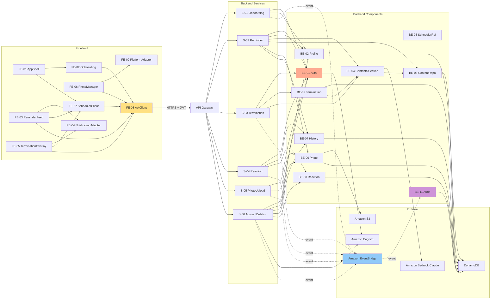

# Component Dependency — アフターファイブ

**Version**: 2.0
**Last Updated**: 2026-05-08
**Communication Pattern**: ハイブリッド (D1=D)
- **同期直接呼び出し**: 主要 CRUD と Reminder (ダメな未来配信) / Termination (堕落ゲート) のコアフロー (Service → Component → Repository)
- **イベント駆動 (EventBridge)**: 監査 / 通知 / アカウント削除 / リアクション→堕落ゲート

---

## 1. High-Level Dependency Graph



### Text Alternative

```
Call sequence (simplified):
  Frontend (FE-01..09) → ApiClient (FE-08) → API Gateway → Lambda Service (S-xx)
                                                              ↓
                                             Backend Component (BE-xx)
                                                              ↓
                                             External (Cognito, DDB, S3, Bedrock)
  Side effects: EventBridge → BE-11 Audit → DDB AuditTable
```

---

## 2. Dependency Matrix (Backend)

行: 呼び出し元 / 列: 呼び出し先 / セル: S=Sync (直接)、E=Event (EventBridge)、X=External

| ↓ caller / callee → | S01 | S02 | S03 | S04 | S05 | S06 | BE01 | BE02 | BE03 | BE04 | BE05 | BE06 | BE07 | BE08 | BE09 | BE11 | Cognito | S3 | DDB | Bedrock | EB |
|---|---|---|---|---|---|---|---|---|---|---|---|---|---|---|---|---|---|---|---|---|---|
| **S-01 Onboarding** |   |   |   |   |   |   | S | S |   |   |   |   |   |   |   |   |   |   |   |   | E |
| **S-02 Reminder** |   |   |   |   |   |   | S | S |   | S | S | S | S |   |   |   |   |   |   |   |   |
| **S-03 Termination** |   |   |   |   |   |   | S |   |   | S |   |   |   |   | S |   |   |   |   |   | E |
| **S-04 Reaction** |   |   |   |   |   |   | S |   |   |   |   |   | S | S |   |   |   |   |   |   | E |
| **S-05 PhotoUpload** |   |   |   |   |   |   | S |   |   |   |   | S |   |   |   |   |   |   |   |   | E |
| **S-06 AccountDeletion** |   |   |   |   |   |   | S | S |   |   |   | S | S | S |   |   | X |   |   |   | E |
| **BE-01 Auth** |   |   |   |   |   |   |   |   |   |   |   |   |   |   |   |   | X |   |   |   |   |
| **BE-02 Profile** |   |   |   |   |   |   |   |   |   |   |   |   |   |   |   |   |   |   | X |   |   |
| **BE-04 ContentSelection** |   |   |   |   |   |   |   |   |   |   | S |   |   |   |   |   |   |   |   | X |   |
| **BE-05 ContentRepo** |   |   |   |   |   |   |   |   |   |   |   |   |   |   |   |   |   |   | X |   |   |
| **BE-06 Photo** |   |   |   |   |   |   |   |   |   |   |   |   |   |   |   |   |   | X | X |   |   |
| **BE-07 History** |   |   |   |   |   |   |   |   |   |   |   |   |   |   |   |   |   |   | X |   |   |
| **BE-08 Reaction** |   |   |   |   |   |   |   |   |   |   |   |   |   |   |   |   |   |   | X |   |   |
| **BE-09 Termination** |   |   |   |   |   |   |   |   |   | S |   |   |   |   |   |   |   |   | X |   |   |
| **BE-11 Audit** (EB consumer) |   |   |   |   |   |   |   |   |   |   |   |   |   |   |   |   |   |   | X |   |   |

**No cycles detected** — Services のみが Components を呼び、Components は他 Component を最小限 (BE-04↔BE-05, BE-09→BE-04) で呼ぶ。

---

## 3. Communication Patterns

### 3.1 Synchronous (Request/Response, 主要フロー)

| From → To | プロトコル | 典型レイテンシ | リトライ方針 |
|---|---|---|---|
| Client → API Gateway | HTTPS (TLS 1.2+) | 0-100ms | クライアント側で idempotent のみ自動 |
| API Gateway → Lambda (Service) | Internal | < 10ms | 自動 |
| Service → Component | in-process function call | 即時 | なし |
| Component → DynamoDB | `boto3` (AWS SDK) | 5-20ms | SDK default exponential backoff |
| Component → S3 | `boto3` | 10-50ms | SDK default |
| Component → Cognito | `boto3` | 20-100ms | SDK default |
| BE-04 → Bedrock | `boto3 bedrock-runtime` | 1-5 秒 | **リトライしない** (コスト高、フォールバックで代替) |

### 3.2 Asynchronous (Event-Driven)

EventBridge の event bus (default or `afterfive-bus`) で副作用系を疎結合化。

| Event Name | Producer | Consumer(s) | Purpose |
|---|---|---|---|
| `user.onboarded` | S-01 Onboarding | BE-11 Audit | 新規登録 + ダメな欲望プロファイル収集完了の監査 |
| `profile.updated` | S-01 Onboarding (or BE-02 via middleware) | BE-11 Audit | プロファイル変更の監査 |
| `reaction.leave_now_requested` | S-04 Reaction | S-03 Termination | 早期堕ち (もう堕ちる) の先行記録 |
| `user.terminated` | S-03 Termination | BE-11 Audit | 堕落ゲート発動記録の監査 |
| `photo.uploaded` | S-05 PhotoUpload | BE-11 Audit, (Future) BE-04 AI tagging | 写真アップロードの記録 |
| `photo.deleted` | S-05 PhotoUpload | BE-11 Audit | 写真削除の監査 |
| `account.deletion.started` | S-06 | BE-11 Audit | アカウント削除開始記録 |
| `account.deletion.completed` | S-06 | BE-11 Audit | アカウント削除完了記録 |

**Event Schema**:
```yaml
detail-type: string (上記 Event Name)
source: "com.afterfive"
detail:
  eventId: uuid
  eventTime: ISO8601
  actor: string (userId or 'system')
  payload: object  # イベント固有データ
```

---

## 4. Cross-Cutting Dependency

全 Backend Component が依存する横断モジュール:

```
┌───────────────────────────────────────┐
│ X-01 Observability (Logger/Tracer)   │ — 全 handler に @inject_lambda_context
└───────────────────────────────────────┘
┌───────────────────────────────────────┐
│ X-02 SharedModels (Pydantic/OpenAPI) │ — 入出力定義
└───────────────────────────────────────┘
┌───────────────────────────────────────┐
│ X-03 RepositoryLayer                 │ — DDB アクセスの抽象
└───────────────────────────────────────┘
┌───────────────────────────────────────┐
│ X-04 ErrorHandling (例外階層)        │ — top-level try/except
└───────────────────────────────────────┘
```

これら 4 つは Python パッケージ (`afterfive-shared`) としてまとめ、Lambda Layer で配布を想定。

---

## 5. Data Flow Diagrams (主要フロー)

### 5.1 Reminder (コア体験 = 堕落ランプ + ダメな未来配信)

```
┌──────────────┐
│ FE-07        │ 17:15 → trigger (堕落ランプが刻む)
│ SchedulerCl. │
│ = 堕落ランプ │
└──────┬───────┘
       │ (1) context 収集 (FE-09 から location, 時刻, 天気ダミー)
       ▼
┌──────────────────────────────────────┐
│ POST /content/next (FE-08 ApiClient) │
└──────────────┬───────────────────────┘
               │ JWT
               ▼
┌───────────────────────────────────┐
│ API Gateway (Authorizer: BE-01)   │
└──────────────┬────────────────────┘
               ▼
┌───────────────────────────────────┐
│ Lambda: s2_reminder                │
│  = ダメな未来ジェネレータ         │
│  S-02.select_and_record_next()    │
│   ├─ ProfileRepo.get              │
│   │   (ダメな欲望プロファイル)    │
│   ├─ HistoryRepo.get_recent(10)   │
│   ├─ BE-04.build_prompt           │
│   │   (D4 "飲まない"なら除外)     │
│   ├─ InvokeModel (Bedrock) 5s     │
│   ├─ BE-04.sanitize/validate      │
│   ├─ [family/pet] PhotoRepo pick  │
│   └─ HistoryRepo.append           │
└──────────────┬────────────────────┘
               ▼
          ContentResponse (ダメな未来)
               │
               ▼
          FE-03 render modal / FE-04 notify
```

### 5.2 Termination (定時 = 堕落ゲート発動)

```
FE-07 SchedulerClient (堕落ランプ) — 18:00:00 detect
   └─► FE-05 TerminationOverlay (堕落ゲート UI).show('PUNCTUALITY')
         └─ user clicks 退勤 button (= 堕落宣言ボタン)
              └─► POST /terminations/clock-out → Lambda: s3_termination
                    ├─ verify_jwt (BE-01)
                    ├─ TerminationRepo.put_if_absent (堕落ゲート日次冪等)
                    ├─ BE-04.generate_closing_message (ダメモード突入メッセージ)
                    │   (Bedrock, fallback あり)
                    └─ EventBridge emit user.terminated → BE-11 Audit
              ◄── 200 TerminationResponse { recorded: true, message: "..." }
         └─ overlay shows message (ダメモード突入完了), cleared
```

### 5.3 Photo Upload

```
FE-06 PhotoManager                    Backend                       S3
     │                                  │                            │
     ├─ POST /photos/upload-url ───────►│                            │
     │  {filename, MIME, size, tag}    │ BE-01 verify_jwt           │
     │                                  │ S-05 issue_upload_url       │
     │                                  │  - validate MIME/ext/size  │
     │                                  │  - generate photoId (uuid) │
     │                                  │  - S3 presign PUT           │
     │                                  │  - PhotoRepo.put(PENDING)   │
     │◄── { presignedUrl, photoId } ────┤                            │
     │                                                               │
     ├── PUT presignedUrl (file binary) ─────────────────────────────►│
     │◄── 200 ─────────────────────────────────────────────────────── │
     │                                                               │
     ├─ POST /photos/{photoId}/confirm ─►│                           │
     │                                  │ S3 HEAD (verify)           │
     │                                  │ PhotoRepo.update(ACTIVE)   │
     │                                  │ EventBridge photo.uploaded │
     │◄── 200 Photo ────────────────────┤                           │
```

---

## 6. Deployment-Level Grouping (予告: Units Generation の前提)

Application Design の構造が以下のように Unit に対応すると予想:

| 想定 Unit | 含まれる Components |
|---|---|
| `U1-identity` | BE-01 Auth + S-01 Onboarding + S-06 AccountDeletion + BE-02 Profile |
| `U2-reminder` | S-02 Reminder + BE-03 SchedulerRef + BE-04 ContentSelection + BE-05 ContentRepo + BE-07 History |
| `U3-reaction-termination` | S-03 Termination + S-04 Reaction + BE-08 Reaction + BE-09 Termination |
| `U4-photo` | S-05 PhotoUpload + BE-06 Photo |
| `U5-audit-observability` | BE-11 Audit + X-01 Observability |
| `U6-shared` | X-02 SharedModels + X-03 RepositoryLayer + X-04 ErrorHandling |
| `U7-frontend` | FE-01〜FE-09 (Tauri + Web 両ビルド) |
| `U8-infrastructure` | BE-12 InfrastructureComponent (CDK) |

**詳細は次ステージ (Units Generation) で確定。**

---

## 7. Cyclic Dependency Check

**Forward Direction Rule**:
- Frontend → (HTTP) → Service → Component → External (AWS) — 逆方向 call なし ✅
- Component 間呼び出しは BE-04 → BE-05 (Content 選定時に Repository 参照)、BE-09 → BE-04 (termination message 生成) の 2 件のみ、循環なし ✅
- EventBridge (非同期) は戻り値を期待しないため循環の心配なし ✅

## 8. Security-Critical Paths (追跡必須)

| Path | Security Rules 適用箇所 |
|---|---|
| Client → /content/next | SEC-08 (JWT), SEC-03 (PII log除外), SEC-05 (input validation), SEC-15 (Bedrock failover) |
| Client → /photos/upload-url → S3 PUT | SEC-01 (SSE), SEC-05 (MIME/ext/size), SEC-08 (prefix 制限), SEC-09 (S3 Public Block) |
| Client → /photos/{id} (DELETE) | SEC-08 (IDOR 多層), SEC-13 (audit), SEC-14 (append-only) |
| Client → /profile (PATCH) | SEC-05, SEC-08, SEC-13 |
| 全 API | SEC-04 (Web 版 CloudFront のヘッダー), SEC-07 (API GW + CloudFront のみ公開), SEC-11 (Usage Plan) |
