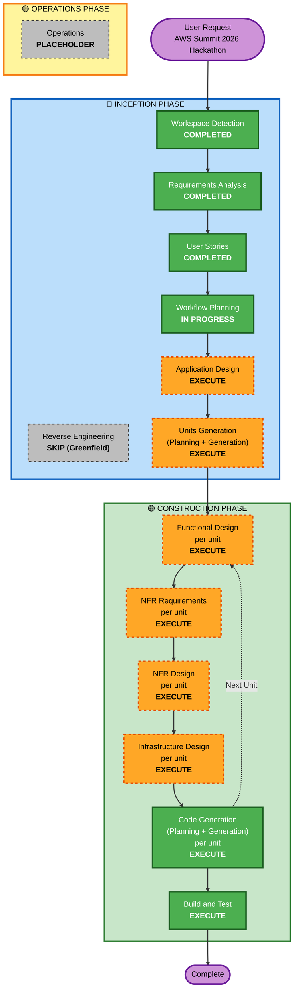

# Execution Plan — アフターファイブ

**Stage**: INCEPTION — Workflow Planning
**Project Type**: Greenfield
**Date**: 2026-05-08

---

## Detailed Analysis Summary

### Transformation Scope
N/A (Greenfield プロジェクト)

### Change Impact Assessment

| 観点 | 評価 | 説明 |
|---|---|---|
| **User-facing changes** | Yes (全面) | コア体験そのものが新規 UX (堕落煽り系コンテンツ、堕落ゲート) |
| **Structural changes** | Yes (全面) | システム新規構築、サーバーレス構成 (CloudFront + S3 + API Gateway + Lambda + Cognito + DynamoDB + Bedrock) |
| **Data model changes** | Yes (新規) | UserProfile (ダメな欲望プロファイル), Content, PresentationHistory, Reaction, Photo の 5 系エンティティ |
| **API changes** | Yes (新規) | REST API Gateway で 10〜15 エンドポイント新設想定 |
| **NFR impact** | Yes (高) | Security Baseline 15 ルール + PBT 10 ルール を enforced として適用 |

### Complexity Drivers
- マルチチャネル配信 (Tauri デスクトップ + Web PWA の 2 ビルド)
- 動的スケジューラ (堕落ランプ — 時刻によって提示頻度が単調非増加で変動、状態を持つ)
- AI (Bedrock) 連携 (堕落煽りプロンプト設計、フォールバック、コスト最適化)
- 7 種類のダメな欲望カテゴリ D1-D7 (MVP は D1-D6 = 家族・推し・食・**酒 (D4)**・趣味・通勤天気)
- リアクション/履歴の冪等書き込み、堕落ゲート日次冪等
- プライバシー設計 (位置情報粒度、IDOR 対策、画像の所有権チェック、D4「飲まない」ユーザー意思尊重)
- セキュリティ要件 (Cognito + 暗号化 + 入力検証 + レート制限 + 監査)

### Risk Assessment
- **Risk Level**: **Medium-High**
- **Rollback Complexity**: Easy (MVP 段階、本番データなし、IaC による再構築)
- **Testing Complexity**: Complex (PBT + E2E + 2 ビルドでの動作確認)

---

## Workflow Visualization



### Text Alternative (Fallback)

```text
INCEPTION PHASE:
  1. Workspace Detection ..................... [COMPLETED]
  2. Reverse Engineering ..................... [SKIP - Greenfield]
  3. Requirements Analysis ................... [COMPLETED]
  4. User Stories ............................ [COMPLETED]
  5. Workflow Planning ....................... [IN PROGRESS]
  6. Application Design ...................... [EXECUTE]
  7. Units Generation (Planning + Generation)  [EXECUTE]

CONSTRUCTION PHASE (per unit loop):
  8. Functional Design (per unit) ............ [EXECUTE]
  9. NFR Requirements (per unit) ............. [EXECUTE]
 10. NFR Design (per unit) ................... [EXECUTE]
 11. Infrastructure Design (per unit) ........ [EXECUTE]
 12. Code Generation (per unit, Plan + Gen) .. [EXECUTE]
 13. Build and Test ........................... [EXECUTE]

OPERATIONS PHASE:
 14. Operations ............................... [PLACEHOLDER - future]
```

---

## Phases to Execute

### 🔵 INCEPTION PHASE

- [x] **Workspace Detection** — COMPLETED
- [ ] **Reverse Engineering** — SKIP
  - **Rationale**: Greenfield プロジェクト、既存コードなし
- [x] **Requirements Analysis** — COMPLETED
  - 27 FR/NFR (Security Baseline + PBT Extension を enforced)
- [x] **User Stories** — COMPLETED
  - 27 Job Stories / 5 Epics / 4 Personas / 完全 Traceability Matrix
- [ ] **Application Design** — **EXECUTE**
  - **Rationale**: 新規システムで複数コンポーネントを定義する必要あり。責務分離と サービスレイヤの事前設計は Units Generation 前提になる。**ハッカソン審査軸「Unit 分解の適切さ」に直結**。
  - **Artifacts**: `components.md`, `component-methods.md`, `services.md`, `component-dependency.md`, `application-design.md`
- [ ] **Units Generation** — **EXECUTE**
  - **Rationale**: システムは明確に複数サービスに分解可能 (Auth / Profile / Scheduler / Content / Notification / Termination / Photo / Frontend / Infrastructure)。Units 分解はハッカソンの推し論点。
  - **Artifacts**: `unit-of-work.md`, `unit-of-work-dependency.md`, `unit-of-work-story-map.md`

### 🟢 CONSTRUCTION PHASE (Per-Unit Loop)

各 Unit について下記 5 ステージを順次実行:

- [ ] **Functional Design** — **EXECUTE** (全 Unit)
  - **Rationale**: 新規データモデル (UserProfile/Content/History/Reaction/Photo) + 複雑なビジネスロジック (動的スケジューラ、AI プロンプト、フォールバック戦略)。PBT-01 (Property Identification) 要件としても必須。
- [ ] **NFR Requirements** — **EXECUTE** (全 Unit)
  - **Rationale**: Security Baseline + PBT 両 Extension が Enforced。Unit ごとにレイテンシ/スケール/セキュリティ/信頼性の要求を明文化する必要あり。PBT-09 (Framework Selection) 要件を満たすため。
- [ ] **NFR Design** — **EXECUTE** (全 Unit)
  - **Rationale**: NFR 要件を踏まえた設計 (レート制限、リトライ、冪等キー、キャッシュ戦略、Bedrock フォールバック等) を明示する必要あり。
- [ ] **Infrastructure Design** — **EXECUTE** (全 Unit)
  - **Rationale**: AWS マルチサービス構成 (Cognito / API Gateway / Lambda / DynamoDB / S3 / CloudFront / Bedrock + IaC) の具体設計が必要。SECURITY-01/02/06/07/09 の多数がインフラ層で満たされる。
- [ ] **Code Generation** — **EXECUTE** (全 Unit、ALWAYS)
  - **Rationale**: 実装必須。Planning → Generation の 2 ステップ運用。
- [ ] **Build and Test** — **EXECUTE** (ALWAYS)
  - **Rationale**: ビルド手順 + 単体テスト (pytest/vitest) + PBT (Hypothesis/fast-check) + 統合テスト + E2E デモシナリオ。PBT-08 (Reproducibility) & PBT-10 (Complementary) 要件。

### 🟡 OPERATIONS PHASE

- [ ] **Operations** — PLACEHOLDER
  - **Rationale**: 現時点は placeholder。MVP 完成後にデプロイ/モニタリング workflow を追加検討。

---

## Rationale Summary: Why Execute All Conditional Stages

本プロジェクトは以下の理由で **全 conditional ステージを EXECUTE** とする設計を推奨:

1. **ハッカソンの審査軸**: ユーザー自身が Q3 で強調した審査軸「**ビジネス意図の明確さ / 創造性とテーマ適合性 / Unit 分解の適切さ / ドキュメントの品質 / アイデアと技術のバランス**」は、AI-DLC 全ステージの成果物がそのままエビデンスになる。途中ステージを省くと審査でのストーリーが弱くなる。
2. **Security / PBT Extensions が Enforced**: 全ルールを blocking 制約としているため、Functional Design と NFR Design で個別に対応方針を示さないと blocking finding が出る。
3. **Greenfield + Complex**: 完全新規 + マルチチャネル + AI + セキュリティ要件ありで、Application Design から設計を積むのが最も効率的。
4. **ユーザーの期待値**: Q2 で「MVP 2 週間、デモ 1ヶ月、すべての機能を丁寧に実装」 を選択 (X 回答)。期間的にも全ステージ実行で余裕がある。

---

## Estimated Timeline

| フェーズ | ステージ数 | 期間目安 |
|---|---|---|
| INCEPTION 残り (Application Design + Units Generation) | 2 | 1-2 日 |
| CONSTRUCTION per-unit ループ (仮に 8 Units) | 8 × 5 = 40 ステージ実行 | 7-10 日 (並列可) |
| Build and Test | 1 | 1-2 日 |
| **合計** | | **約 2 週間 (MVP)** |

- **MVP (2 週間)**: Units のうち MVP 分 (Auth, Profile, Scheduler=堕落ランプ, Content=ダメな未来ジェネレータ, Notification, Termination=堕落ゲート, Photo) を実装、Full 分は後回し
- **フルデモ (1 ヶ月)**: Full ラベルの Story まで含めて実装、Build and Test で E2E デモシナリオを作り込み

---

## Success Criteria

- **Primary Goal**: AWS Summit 2026 ハッカソンで評価される MVP を完成させる。審査軸の 5 点 (意図 / 創造性 / Unit 分解 / ドキュメント / 技術バランス) すべてで高得点を狙う。コンセプト (ダメにする哲学 + 明日の創造性 仮説) を一貫して語る。
- **Key Deliverables**:
  - `aidlc-docs/` 配下の全ドキュメント (Requirements → Stories → Application Design → Units → Per-Unit Design → Code Plan + Summary → Build & Test)
  - 動く Tauri デスクトップアプリ + Web PWA
  - デモ可能な堕落ゲート + ダメな未来ジェネレータ (Bedrock) の連携
  - CI/CD 済みの AWS バックエンド (IaC 付き)
- **Quality Gates**:
  - Security Baseline 15 ルール全てで Compliant or N/A (blocking finding ゼロ)
  - PBT 10 ルール全てで Compliant or N/A (blocking finding ゼロ)
  - MVP Story (20 件) すべて AC を満たす
  - E2E デモシナリオ (17:00 ログイン → 堕落ランプで D1-D6 連発 → 18:00 堕落ゲート → ダメモード突入) が 1 発で流れる

---

## Content Validation

この計画ドキュメント作成時に以下を検証:

- [x] Mermaid 構文: ノード ID はすべて英数字のみ、矢印構文有効、subgraph 正しくネスト
- [x] ASCII 代替テキスト: 全角/半角混在なし、文字幅揃え
- [x] 特殊文字エスケープ: コロン・括弧は Markdown 互換で使用
- [x] Fallback: Mermaid が描画失敗しても Text Alternative で内容が伝わる
